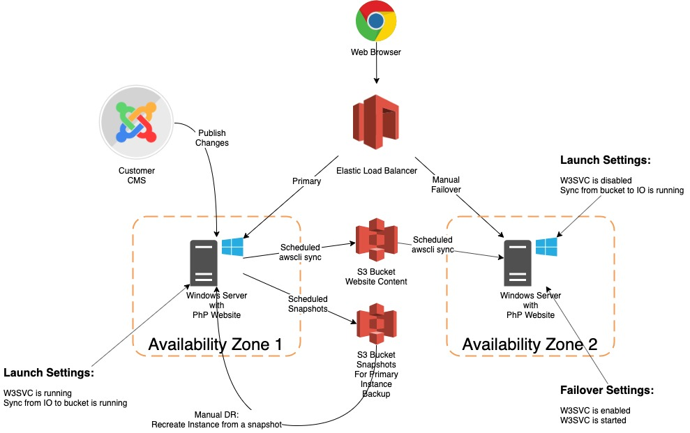

# Revize Aws Setup Automation

## Requirements



1. Create automation to launch two ec2 instances running Windows Server 2019
1. The instances will be provisioned from a custom built AMI image with IIS configured manually
1. The primary instance will automatically sync data to S3 bucket
1. The fail-over instance will automatically sync data from S3 bucket
1. A load balancer will be configured pointing to both instances
1. The primary instance will have W3SVC running on launch and will serve all the traffic
1. The fail-over instance will be launched with W3SVC disabled
1. The primary instance will have periodic snapshots taken in automated fashion
1. Switching to a fail-over instance will require manual intervention to enable and to start W3SVC
1. Restoring primary instance from a snapshot will be a manual procedure
1. Publishing data from a customer CMS to the primary instance is out-of-scope for this deliverable


## Building your AMI for Windows Server

* Launch ec2 instance with the provided AMI image
* Connect to ec2 instance and configure desired features and deploy initial website content
* `./web-server/ami-setup.ps1` has initial setup for a vanilla Windows Server
* Create [custom AMI](https://aws.amazon.com/premiumsupport/knowledge-center/sysprep-create-install-ec2-windows-amis/) from the configured instance

## One-time local setup

* Have handy or generate new [access key and secret](https://docs.aws.amazon.com/general/latest/gr/aws-sec-cred-types.html#access-keys-and-secret-access-keys) for your account
* Clone the repo: `git clone https://github.com/vkhazin/revize-aws-setup.git`
* Run in terminal: `cd ./revize-aws-setup`
* MacOS, run in terminal: `find . -name "*.sh" -exec chmod +rx {} \; && ./scripts/local-setup-macos.sh`
* Cloud9,  run in terminal: `find . -name "*.sh" -exec chmod +rx {} \; && ./scripts/local-setup-cloud9.sh`

## Before Deployment

* [Create an s3 bucket](https://docs.aws.amazon.com/AmazonS3/latest/gsg/CreatingABucket.html) to store terraform state in the desired region
* [Create ssh key pair](https://docs.aws.amazon.com/cli/latest/userguide/cli-services-ec2-keypairs.html) in the desired region to decrypt Windows Administrator password
* Copy custom AMI id created in the previous steps
* Update [./envs/global.sh](./envs/global.sh) to reflect the new values for: ssh key pair, ami id, and terraform state

## Deployment

* To verify without applying: `./scripts/plan.sh dev`
* To create/update a deployment: `./scripts/apply.sh dev`
* To delete an existing deployment: `./scripts/destroy.sh dev`, **NOTE:** non-empty bucket(s) will not be deleted!

## Operation

* Primary instance copies new and updated files from `c:\revize\web` folder to webcontent bucket every 5 mins
* Primary instance copies new and update files from `$env:windir\System32\Inetsrv\Config\` folder to iisconfig bucket every 5 minutes
* iisconfig bucket has [versioning](https://docs.aws.amazon.com/AmazonS3/latest/dev/Versioning.html) enabled
* Failover instance copies new and updated files from s3 webcontent and iisconfig buckets every 5 mins
* Load balancer is sending traffic to the primary instance only
* When primary instance is down failover instance requires manual intervention: enabling and starting w3svc service:
```
Set-Service W3SVC -StartupType Automatic
net start W3SVC
```
* After w3svc services is running on failover instance  load balancer will be sending traffic to failover instance
* ***Important:*** the failover instance does not copy files from local system to s3 bucket
* Primary instance volume snapshot is backed-up using [Amazon EBS Snapshot life-cycle](https://docs.aws.amazon.com/AWSEC2/latest/UserGuide/snapshot-lifecycle.html)
* To restore primary web server instance from a snapshot follow [AWS documentation](https://docs.aws.amazon.com/AWSEC2/latest/UserGuide/ebs-restoring-volume.html)

### Next Step: Configuration Management

1. A solution tailored to current skills set with Windows platform:


1. A solution tailored toward a more robust functionality:
* ESC, Fargate, or EKS custer
* Immutable containers per customer
* Docker image modification when existing customer configuration changes
* Kubernetes deployment and configuration
* Traffic shaping for canary releases and/or A/B testing